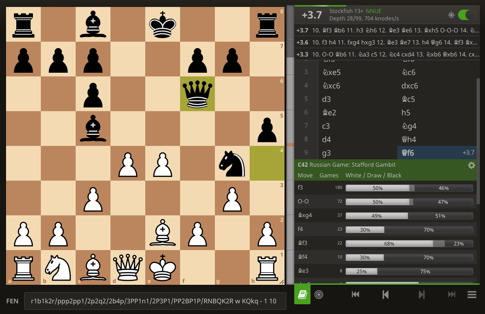

import Chessground from "react-chessground"

## Intro

The Stafford Gambit is a line that Black can chose in the Philidor (a.k.a Russian Game).
It became massively popular after IM Eric Rosen started sharing his knowledge about it.
The Stafford Gambit arises after:

`1.e4 e5 2.Nf3 Nf6 3.Nxe5 Nf6`

<Chessground
  fen="r1bqkb1r/pppp1ppp/2n2n2/4N3/4P3/8/PPPP1PPP/RNBQKB1R w KQkq - 1 4"
  viewOnly
  orientation="white"
  height={320}
  width={320}
/>

Instead of the usual capture with `3...Nxe4`, Black develops the other Knight and baits White into taking on c6.
The idea is to recapture with dxc6, opening the c8-h3 diagonal for Black's LSB.
This will speed up Black's development and create some attacking possibilities on the king-side.  
White needs to be very well prepared against this line in order not to fall after some sacs and mate.

`4. Nxc6 dxc6`  
White accepts the gambit and Black recaptures as planned.  
The approach we will follow as White is the one recommended by [Daniel Naroditsky](https://www.youtube.com/watch?v=lLzLAJcRn-Q&ab_channel=DanielNaroditsky).

`5.d3 Bc5 6.Be2 h5`  
The most popular move. The idea is to play Ng4 and recapture with the h-pawn in case of Bxg4.

`7.c3`

<Chessground
  fen="r1bqk2r/ppp2pp1/2p2n2/2b4p/4P3/2PP4/PP2BPPP/RNBQK2R b KQkq - 0 7"
  viewOnly
  orientation="white"
  height={320}
  width={320}
/>

White wants to solidify the center with `d4` and shut Black's DSB out of the attack.

`7...Ng4 8.d4 Qh4`

Black is ready to part with his DSB to accelerate his attack even more.  
The threat is now Qxf2+.

`// TODO`  
8... Bb6 is more popular and covered by Naroditsky, but I've been facing Qh4 a lot more.

`9.g3 Qf6`

9...Qh3?? is met by 10.Bf1!

Here the most popular move recommended by Stockfish is 10.f3, but White only scores 50%.
Surprisingly the fifth popular move (and equally good according to Stockfish) scores 68%:

`10.Bf3`

<Chessground
  fen="r1b1k2r/ppp2pp1/2p2q2/2b4p/3PP1n1/2P2BP1/PP3P1P/RNBQK2R b KQkq - 2 10"
  viewOnly
  orientation="white"
  height={320}
  width={320}
/>

This move is not so intuitive because White moves the Bishop again.  
However it is a nice multi-purpose move, blocking the view of Black's Queen on f2 and defending the rook on h1.

White will then:

- kick the Knight away from g4 with h3.
- threatens the Bishop on b6 with a4.
- and develop harmoniously with Be3 and Nd2.
- Nd2-c4 is an idea to harass the Bishop on b6 or reach e5.

White's extra pawn, massive center and harmonious pieces give him a big advantage and easy game.

`10...Bb6 11.h3 Nh6 12.Be3 Bd7 13.a4 a6 14.Nd2`

<Chessground
  fen="r3k2r/1ppb1pp1/pbp2q1n/7p/P2PP3/2P1BBPP/1P1N1P2/R2QK2R b KQkq - 1 14"
  viewOnly
  orientation="white"
  height={320}
  width={320}
/>

Black's initiative is non-existent.

## Reference games

The following casual 3+2 game was played on lichess literally just after I researched this 10.Bf3 move. Very convincing!

https://lichess.org/lNP39z80

## Must known lines

## Personal win rate

## Interactive reviews

// TODO: Quizz on main Black responses.
